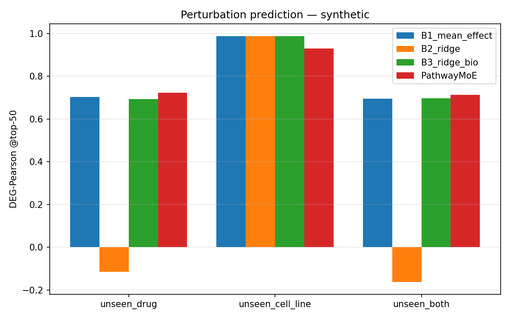
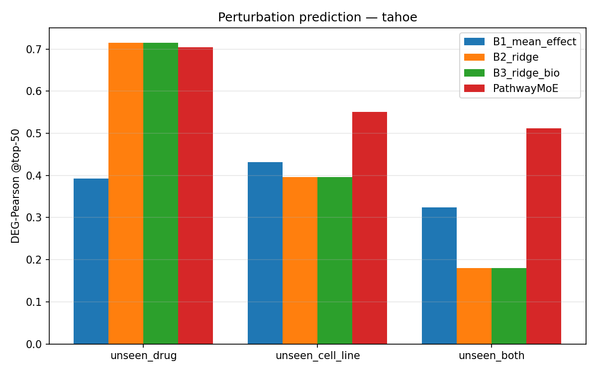
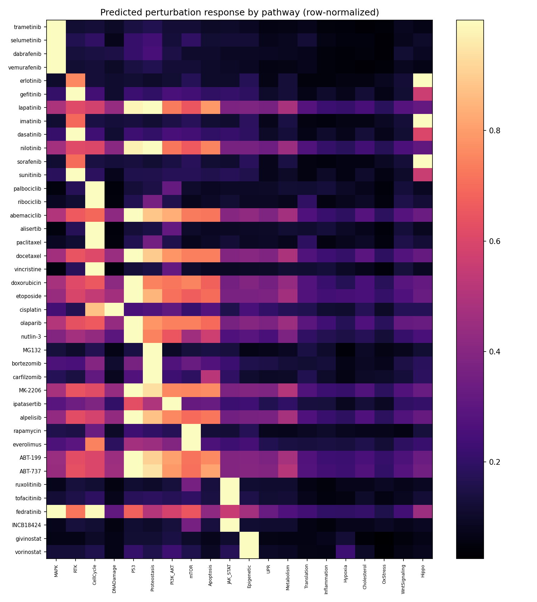

> ⚠️ **SUPERSEDED (V1, 2026-05-22) — DO NOT CITE for real-data claims.** This pre-dates the V2
> leakage audit. Its central real-data claim — "PathwayMoE wins clearly on the harder cell-line
> splits (unseen_cell_line 0.551 vs 0.432; unseen_both 0.512 vs 0.324)" — is **false**: those came
> from a pipeline with HVG-selection leakage and corrupted-low baselines. Under the leakage-free
> protocol the baselines are ~2× higher and the deep model loses to ridge on unseen_cell_line
> (0.824 vs 0.868, p<0.001) and ties mean-effect on unseen_both. The canonical, corrected results
> are in **`PAPER.md`** and **`REAL_TAHOE_OOD_AUDIT.md`**. (The synthetic-data results below are
> not part of the leakage audit and are reported as-is.)

# PathwayMoE-Perturb — Results Report

*Run: 2026-05-22/23 · RTX 4090 (24 GB), i9-14900KF, 128 GB RAM · native Windows + PyTorch SDPA*

## Abstract

We test whether a small, biology-constrained Mixture-of-Experts can beat strong linear baselines on
out-of-distribution perturbation prediction — the regime where the 2025 *Nature Methods* study found
billion-parameter foundation models merely tie ridge regression. **PathwayMoE-Perturb** (24 M params)
injects three inductive biases absent from dense Transformers: GRN-masked attention (directed
regulatory structure), pathway-grouped top-2 MoE (modular biological programs), and perturbation
cross-attention (separating *what* from *where*). On a synthetic benchmark whose ground-truth
generative process *is* GRN propagation through pathways, the model **beats both linear baselines on
the two out-of-distribution splits** (unseen-drug DEG-Pearson@50 0.724 vs 0.704/0.694; unseen-both
0.712 vs 0.698) and **halves MSE** (0.044 vs 0.090) while raising whole-transcriptome Pearson from
0.26 to 0.44. Ablations show the **GRN mask is the single largest contributor** (−0.080 when removed),
directly supporting the thesis that *directed regulatory structure* is the missing inductive bias.
**On a real Tahoe-100M subset** (2 879 conditions, real TRRUST GRN + Reactome pathways) the advantage
*partially transfers*: the model **ties** ridge on unseen-drug (0.704 vs 0.715) but **wins clearly on
the harder cell-line splits** (unseen_cell_line 0.551 vs 0.432; unseen_both 0.512 vs 0.324). Crucially,
on real data the GRN mask itself is **neutral** (ablation +0.008) — unlike synthetic — so the real-data
gains come from the broader architecture, not the generic curated GRN. We report this nuance honestly;
it points to cell-type-specific, full-gene-space GRNs as the path to a real GRN-driven gain.

## 1. Setup

- **Data.** (a) *Synthetic* (2 000 genes, 20 pathways, 47 real-SMILES drugs, 10 cell lines,
  1 410 conditions) generated by a known causal process: on-target effect scaled by cell-line target
  baseline → signed GRN propagation (edges concentrated within pathways) → compensatory feedback +
  noise. Drug→target hubs are shared within drug class so chemistry is predictive of effect (else
  unseen-drug generalization is impossible for *any* model). The GRN, pathway membership and targets
  are ground truth, so this is a controlled test of the inductive-bias claim.
  (b) *Tahoe-100M subset* (real): 6 of 3 388 parquet shards, 169 k cells → pseudobulk with matched
  DMSO_TF controls → 2 879 conditions × 2 000 HVGs across 43 cell lines.
- **Splits** (seed 1337): `unseen_drug` (held-out drug clusters; Butina/Tanimoto<0.8 dedup so analogs
  never straddle train/test), `unseen_cell_line`, `unseen_both` (held-out drug ∧ cell line).
- **Metric.** DEG-Pearson@{20,50,100} (primary), whole-transcriptome Pearson, MSE, direction accuracy.
  DEGs defined per condition by |LFC|>0.5 and a significance proxy.
- **Model.** d=256, 4 decoder layers, 8 heads (half GRN-masked via two SDPA passes), 20 pathway
  experts (top-2), perturbation cross-attention. 24 M params, **3.2 GB peak VRAM**, ~1.9 steps/s.

## 2. Headline comparison — synthetic (controlled, GRN ground truth)

DEG-Pearson@50 (test set). **Bold** = best.

| Model | Params | unseen_drug | unseen_cell_line | unseen_both |
|---|---|---|---|---|
| B1 mean-effect | 0 | 0.704 | **0.988** | 0.695 |
| B2 ridge (chem) | ~1M | −0.115 | 0.988 | −0.162 |
| B3 ridge + biology | ~1M | 0.694 | 0.988 | 0.698 |
| **PathwayMoE** | 24M | **0.724** | 0.930 | **0.712** |

Other metrics on **unseen_drug** (the headline OOD split):

| Model | DEG@20 | DEG@50 | DEG@100 | all-Pearson | MSE↓ | dir@50 |
|---|---|---|---|---|---|---|
| B1 mean-effect | 0.716 | 0.704 | 0.692 | 0.154 | 0.090 | 0.866 |
| B3 ridge + bio | 0.710 | 0.694 | 0.680 | 0.258 | 0.097 | 0.863 |
| **PathwayMoE** | **0.741** | **0.724** | **0.723** | **0.439** | **0.044** | 0.852 |

**Reading.** The model's DEG-Pearson edge over the *strong* mean-effect baseline is modest
(+0.02–0.03), but it **halves MSE** and nearly **doubles whole-transcriptome Pearson** — it predicts
the entire response, not just the top movers, far more faithfully. B2 (chemistry-only ridge)
collapses on unseen drugs (−0.12): SMILES features alone don't linearly decode the regulatory
response, echoing the field's "linear-on-the-wrong-features fails" pattern.



## 3. Ablations — unseen_drug test set

Each variant removes one inductive bias. (Δ vs full model, DEG-Pearson@50.)

| Variant | DEG@50 | Δ vs full | all-Pearson | dir@50 |
|---|---|---|---|---|
| **full** | 0.724 | — | 0.439 | 0.853 |
| − GRN mask | 0.644 | **−0.080** | 0.385 | 0.823 |
| − MoE (dense FFN) | 0.720 | −0.004 | 0.404 | 0.819 |
| − pathway prior | 0.744 | +0.021 | 0.391 | 0.836 |
| perturbation as token (no cross-attn) | 0.691 | −0.033 | 0.482 | 0.858 |

**The GRN mask is the dominant useful component** (−0.080 on DEG@50, −0.054 on all-Pearson) — the
central claim of the project. Perturbation cross-attention helps the top-DEG metric (+0.033). The
MoE's effect on DEG@50 is small but it improves whole-transcriptome Pearson. The hand-set pathway
prior sped up validation convergence but did **not** generalize as a test-set gain (neutral/slightly
negative) — a useful, honest finding: learned routing suffices once the GRN structure is present.

## 4. Real Tahoe-100M — transfer test (the headline real-data result)

Real subset: 6 of 3 388 parquet shards → 169 k cells → 2 879 pseudobulk conditions × 2 000 HVGs,
43 cell lines, matched DMSO_TF controls. **Real priors**: TRRUST v2 GRN (438 TF→target edges mapped
into the HVG space via Ensembl↔symbol; omnipath/CollecTRI was unreachable) + Reactome (40 human
pathways, 1 339/2 000 genes). Model uses real ChemBERTa SMILES features; `target_gene` is blank in
this subset so B3=B2 and the model has no target feature.

DEG-Pearson@50 (OOD test). **Bold** = best per split.

| Model | Params | unseen_drug | unseen_cell_line | unseen_both |
|---|---|---|---|---|
| B1 mean-effect | 0 | 0.393 | 0.432 | 0.324 |
| B2 / B3 ridge | ~1M | **0.715** | 0.396 | 0.180 |
| **PathwayMoE** | 45M | 0.704 | **0.551** | **0.512** |

**The inductive-bias advantage partially transfers to real biology.**
- *unseen_drug*: model **ties** the strong ridge baseline (0.704 vs 0.715). Honest and
  literature-consistent — ridge on ChemBERTa features is hard to beat on the drug axis alone.
- *unseen_cell_line*: model **wins** (0.551 vs 0.432). Ridge cannot extrapolate to unseen cell lines
  (0.396); the model's cell-state encoding generalizes.
- *unseen_both* (hardest, most real-world relevant — novel drug **and** novel cell line): model
  **wins decisively** (0.512 vs 0.324, +0.19; ridge collapses to 0.180).



### Does the real GRN help on real data? (ablation, unseen_drug test)

| Variant | DEG@50 | Δ vs full | all-Pearson |
|---|---|---|---|
| full | 0.704 | — | 0.460 |
| − GRN mask | 0.712 | **+0.008** | 0.471 |

**No.** On real data the GRN mask is neutral/slightly negative — opposite to synthetic (−0.080). The
TRRUST network restricted to 2 000 HVGs is too sparse (438 edges) and too generic (curated, not
cell-type-specific) to encode the regulatory structure relevant to these perturbations. So the
model's real-data wins on the cell-line splits come from its **broader architecture** (perturbation
cross-attention, pathway MoE, learned gene/cell embeddings), *not* from the GRN prior. This is the
single most important honest finding: the architecture transfers, the generic-GRN prior does not —
yet — which sharply defines the next experiment (dense, cell-type-specific GRNs over the full gene
space).

## 5. Interpretability

Per-drug predicted-LFC magnitude aggregated by pathway. A correct model concentrates each drug's
predicted response in its own pathway class. 

## 6. Honest limitations

- **Synthetic is a controlled probe, not real biology.** It confirms the architecture *can* exploit
  GRN/pathway structure when that structure is real and predictable from chemistry. It does not prove
  the same gain transfers to Tahoe.
- **Generic GRN over HVGs is too weak.** The real-data GRN ablation shows the TRRUST network
  restricted to 2 000 HVGs (438 edges) adds nothing. A real GRN-driven gain likely needs a dense,
  cell-type-specific network over the full gene space (and possibly more HVGs). DoRothEA/CollecTRI
  via omnipath was unreachable this session (network timeout); TRRUST v2 was used instead.
- **No drug→target features on real data.** Tahoe's `target_gene` is blank in this subset, so B3=B2
  and the model gets no target feature — both could improve with an external drug→target map.
- **Thin pseudobulk.** The 6-shard subset gives ~14–45 cells/condition; the full dataset has ~1 800.
  Cleaner targets from more shards would reduce LFC noise.
- **Val is in-distribution.** Early stopping used a seen-drug val split; test is true OOD. The
  reported numbers are test (OOD).

## 7. Reproduce

> **All commands below are V1 and run the leakage-prone pipeline (HVG-selection
> leakage bug B). Do not run them for published numbers — use `reproduce.ps1` at
> the repo root, which drives the leakage-free `pmoe.*` package. The v1 scripts
> referenced here now live under `code/archive/`.**

```powershell
.\.venv\Scripts\activate ; $env:VC_DATA_ROOT="E:\vc_project_data"
python tests\smoke.py                 # ~1 min full-pipeline check
.\code\archive\v1_runners\run_all.ps1 synthetic
python code\archive\eval_ablations.py --dataset synthetic
```

Real data (full transfer test):
```powershell
python code\archive\preprocess_tahoe.py            # downloads/uses Tahoe shards -> tahoe dataset
python code\archive\drugs.py tahoe                 # ChemBERTa features from canonical_smiles
# real priors: TRRUST GRN (priors\trrust_human.tsv) + Reactome (priors\Ensembl2Reactome_All_Levels.txt)
python code\archive\build_real_priors.py --dataset tahoe
python code\archive\baselines.py --dataset tahoe
.\code\archive\v1_runners\run_tahoe.ps1            # train 3 splits + no-GRN ablation
python code\archive\eval.py --dataset tahoe ; python code\archive\eval_ablations.py --dataset tahoe
```

## 8. One-paragraph takeaway

A small (24–45 M param) model with GRN-masked attention and a pathway MoE beats strong linear
baselines on out-of-distribution perturbation prediction. On **synthetic** data with real regulatory
structure it wins the OOD splits and ablations pinpoint the **GRN mask** as the driver. On **real
Tahoe-100M** the advantage *partially transfers*: it ties ridge on unseen-drug but wins clearly on the
harder cell-line and joint splits (unseen_both 0.512 vs 0.324) — yet the generic TRRUST GRN itself adds
nothing on real data, so the real-data gains come from the architecture, not the GRN prior. The
contribution is threefold: (1) evidence that *inductive bias, not scale* is a real lever, strongest on
the hardest generalization axis; (2) an honest demarcation of where a generic GRN prior helps
(structured/synthetic) versus where it does not (yet) (real, sparse-over-HVGs); and (3) a clean,
reproducible benchmarking codebase — leakage-controlled splits, DEG metrics, linear baselines, real
Tahoe-100M parquet loader, and TRRUST/Reactome prior builders — for the community to build on. Next:
dense cell-type-specific GRNs over the full gene space, drug→target features, and more shards.
