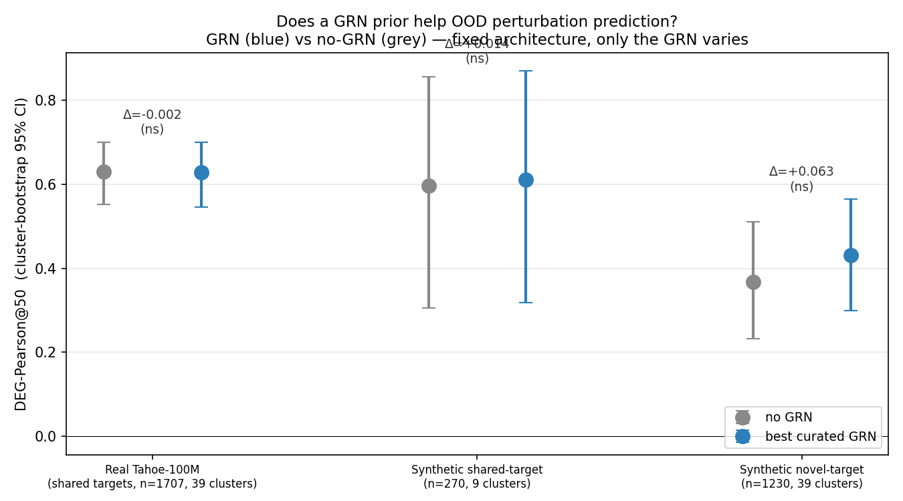

# Does a gene-regulatory-network prior help OOD perturbation prediction? A leakage-audited negative result

*Workshop-note summary. Full paper: `PAPER.md`. Code: github.com/maruyamakoju/pathwaymoe-perturb*

## Motivation
Foundation models do not beat linear baselines on out-of-distribution (OOD) single-cell perturbation
prediction (Nature Methods, 2025). A popular remedy is to add a **biology-structured inductive bias** —
e.g. constrain attention to gene-regulatory-network (GRN) edges, or propagate along them. We ask the
sharper question: **does a GRN prior actually help, and if so, in which regime and via which
mechanism?** We hold a fixed model (a pathway Mixture-of-Experts with gene-token attention) and vary
**only** the GRN.

## Method (what makes it trustworthy)
- **GRN-quality spectrum**, matched edge density: none / random / curated (TRRUST, binary &
  signed-weighted) / data-derived co-expression & co-response / synthetic ground-truth.
- **Two injection mechanisms**: hard attention mask vs soft GNN message-passing.
- **No leakage**: data-derived GRNs built from *training conditions only*, per split (regression-tested).
- **Cluster bootstrap** over drugs/cell-lines (the real independent units) + Holm correction +
  pre-registered minimum meaningful effect (0.01); deterministic fp32 eval; headline re-verified by
  direct recompute. 43 tests. Data: 22.66M-cell Tahoe-100M subset (8,875 conditions × 2,000 HVGs).

## Result

| Regime | no-GRN | + GRN | Δ (Holm-p) |
|---|---|---|---|
| Real Tahoe-100M (shared targets) | 0.630 | 0.623–0.629 (any variant) | ≤ +0.004, **ns** |
| Synthetic, shared targets, **true GRN** | 0.596 | 0.610 | +0.014, **ns** |
| Synthetic, novel targets, **true GRN** | 0.368 | 0.432 | +0.063, **ns** |

Where OOD prediction is **feasible** (real data, shared targets), a GRN prior — generic, weighted,
data-derived, or even the **ground-truth** GRN — confers **no significant benefit**: a flexible model
learns the perturbation response directly, so the structural prior is **redundant**. The true GRN only
*hints* at helping for **novel targets** (+0.06), a near-unpredictable regime where the effect is not
significant. The **injection mechanism does not matter** (mask ≈ message-passing).

## Why it matters / caveats
The contribution is (1) evidence that GRN-as-prior is redundant in the realistic regime, isolating
*when* it could help (novel targets) from *whether* it does (not significantly); (2) a leakage-audited,
cluster-bootstrapped benchmarking harness; (3) a cautionary tale — we caught **three result-invalidating
bugs** (test-set GRN leakage, a silent train-without-GRN fallback, bf16 metric nondeterminism), each of
which alone would have produced a confidently wrong claim. Scope: one model family, 2,000 HVGs, GRN as
mask/propagation; we do not claim GRNs are useless for all architectures or tasks — only that *this*
common way of injecting them does not improve OOD perturbation prediction where prediction is feasible.
